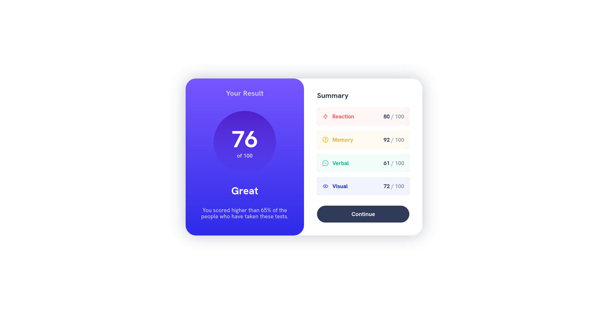
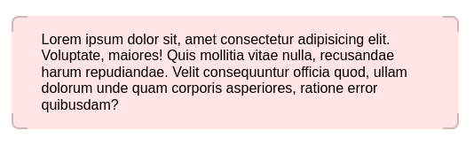

# Frontend Mentor - Results summary component solution

This is a solution to the [Results summary component challenge on Frontend Mentor](https://www.frontendmentor.io/challenges/results-summary-component-CE_K6s0maV). Frontend Mentor challenges help you improve your coding skills by building realistic projects. 

## Table of contents

- [Overview](#overview)
  - [The challenge](#the-challenge)
  - [Screenshot](#screenshot)
  - [Links](#links)
- [My process](#my-process)
  - [Built with](#built-with)
  - [What I learned](#what-i-learned)
  - [Continued development](#continued-development)
  - [Useful resources](#useful-resources)
- [Author](#author)


## Overview

### The challenge

Users should be able to:

- View the optimal layout for the interface depending on their device's screen size
- See hover and focus states for all interactive elements on the page

### Screenshot



### Links

- Solution URL: [https://github.com/elioflo/results-summary-component-main](https://github.com/elioflo/results-summary-component-main)
- Live Site URL: [https://elioflo.github.io/results-summary-component-main/](https://elioflo.github.io/results-summary-component-main/)

## My process

### Built with

- Semantic HTML5 markup
- CSS custom properties
- Flexbox
- CSS Grid
- Mobile-first workflow
- SASS
- BEM
### What I learned

I had some difficulty figuring out how to create corners for my boxes, but this post has been extremely helpful! With the information provided, I was able to successfully create the corners I needed.

The code:

```html
<div class="container container--corners container--red">
  <div class="container__bg">
  </div>
  <div class="container__content">
    <p>Lorem ipsum dolor sit, amet consectetur adipisicing elit. Voluptate, maiores! Quis mollitia vitae nulla, recusandae harum repudiandae. Velit consequuntur officia quod, ullam dolorum unde quam corporis asperiores, ratione error quibusdam?</p>
  </div>
</div>
```
```scss
.container {
  margin: 1rem 0;
  width: 500px;
  --border-size: 2px;
  --border-size-negative: calc(0px - var(--border-size));
  --border-radius: .5rem;
  --border-color: rgba(0,0,0,.2);
  --corner-size: 1rem;
  --bg-color: rgba(0,0,0,.1);
  
  &--red {
    --bg-color: rgba(255,0,0,.1);
  }
  
  
  &--corners {
    border: var(--border-size) solid var(--border-color);
    border-radius: var(--border-radius);
    position: relative;
    
    &::before, &::after {
      content: '';
      position: absolute;
      display: block;
      background: white;
    } 
    
    &::before {
      top: var(--border-size-negative);
      bottom: var(--border-size-negative);
      left: var(--corner-size);
      right: var(--corner-size);
    }
    
    &::after {
      left: var(--border-size-negative);
      right: var(--border-size-negative);
      top: var(--corner-size);
      bottom: var(--corner-size);
    }
  }
  
  &__bg {
    position: absolute;
    top: var(--border-size-negative);
    bottom: var(--border-size-negative);
    left: var(--border-size-negative);
    right: var(--border-size-negative);
    background-color: var(--bg-color);
    z-index: 1;
    border-radius: var(--border-radius);
  }
  
  &__content {
    position: relative;
    z-index: 2;
    padding: 0 2rem;
  }
}
```

The result:




### Useful resources

- [CodePen](https://codepen.io/ThiemelJiri/post/3-css-border-in-corners-techniques) This post has helped me to understand how to create the corners.
- [css-tricks](https://css-tricks.com/) To seek guidance and learn about CSS regarding any doubts or questions that have appeared.
- [w3school](https://www.w3schools.com/) - To consult about doubts that appeared.
- [mdn_](https://developer.mozilla.org/en-US/) - MDN Web Docs has the most up-to-date and accurate information and the content is presented in an easy-to-understand manner. I also like that it's available in many languages (very important!).

## Author

- Frontend Mentor - [@elioflo](https://www.frontendmentor.io/profile/elioflo)
- Twitter - [@7532elioflo](https://twitter.com/7532elioflo)
